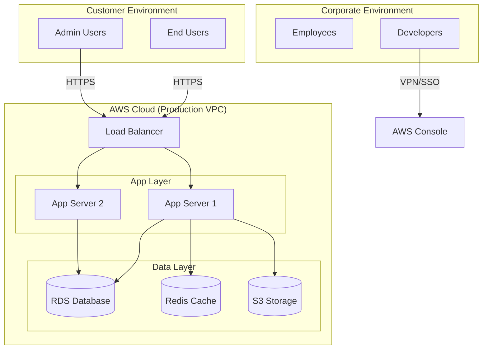
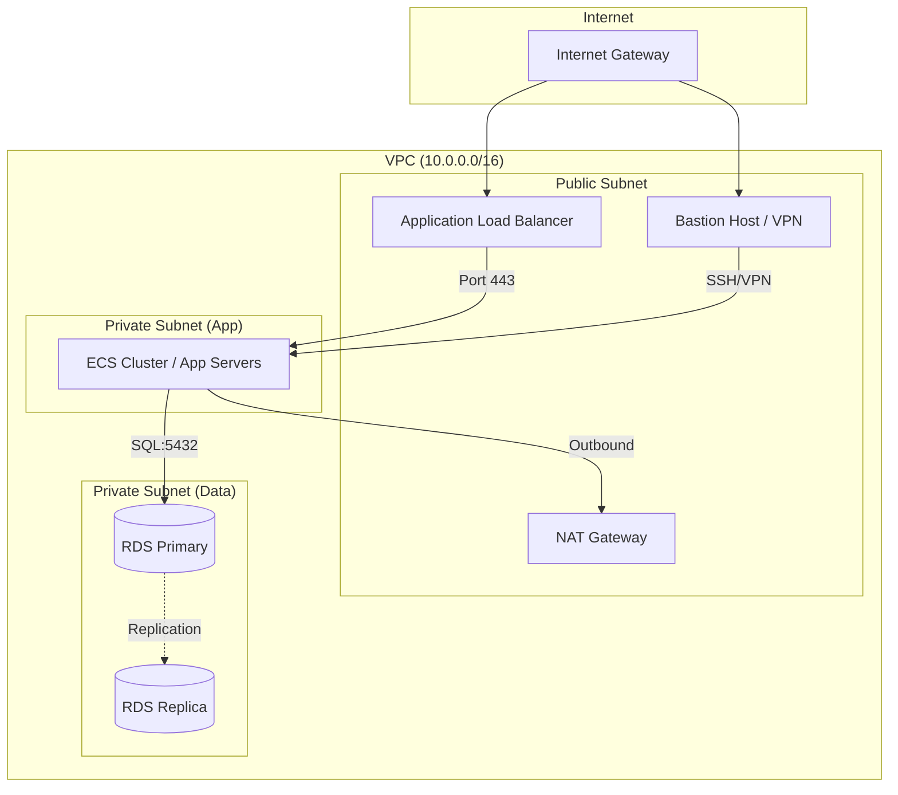
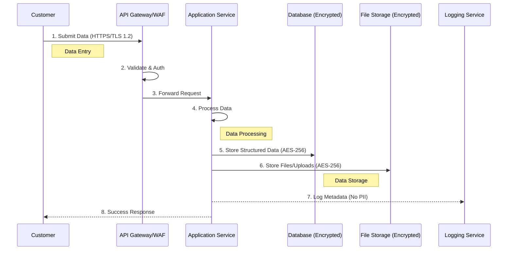

# Diagram Templates (Mermaid.js)

Use these Mermaid.js templates to generate professional diagrams for the Appendices of the System Description.

**How to Use**: Copy the code block into a Markdown viewer that supports Mermaid (like GitHub, Notion, or specialized editors) to render the visual.

---

## Appendix B: System Architecture Diagram

This diagram shows the high-level components of a typical SaaS application on AWS.

---

## Appendix C: Network Diagram

This diagram illustrates network segmentation, subnets, and security groups.

---

## Appendix D: Data Flow Diagram

This diagram shows how customer data flows through the system, from entry to storage.

